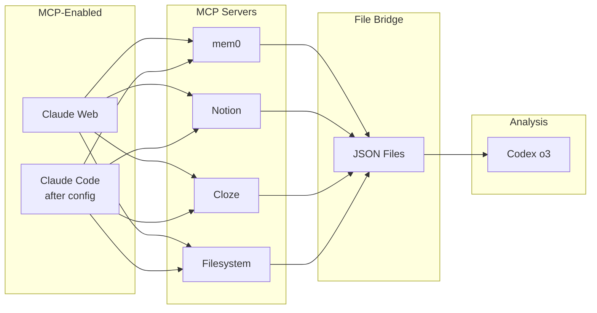

# MCP Server Configuration Guide for AI Trinity

## Current MCP Availability

### Claude Web (Me) - 22 MCP Servers ✅
All MCP servers are accessible directly:
- `mem0` - Shared persistent memory
- `notionApi` - Full Notion API access
- `cloze` - CRM data access (partial - search endpoints having issues)
- `desktop-commander` - System commands
- `macos-automator` - AppleScript/JXA
- `filesystem` - File operations
- `github` - Repository management
- `supabase` - Database operations
- `cognitive-os-obsidian` - Notes integration
- `cognitive-os-whoop` - Biometric data
- `cognitive-os-activitywatch` - Activity tracking
- `sequential-thinking` - Complex reasoning
- `web-search` - Brave search API
- `playwright` - Browser automation
- `figma` - Design file access
- And more...

### Claude Code - Configuration Needed ⚠️
When running interactively, Claude Code shows:
```
No MCP servers configured. Use `claude mcp add` to add a server.
```

To add MCP servers to Claude Code:
```bash
# Add Cloze MCP
claude mcp add cloze node /Users/jamesbrady/Desktop/Cognitive_OS/Cognitive_OS/MCP_Servers/cloze-mcp-server/dist/index.js

# Add Notion MCP
claude mcp add notion npx -y @notionhq/notion-mcp-server

# Add filesystem
claude mcp add filesystem npx @modelcontextprotocol/server-filesystem /Users/jamesbrady

# Add others as needed...
```

### Codex - No Native MCP Support ❌
Codex requires file-based bridges:
1. Claude Web or Claude Code extracts data via MCP
2. Saves to JSON files
3. Codex reads and analyzes the files

## MCP Bridge Pattern



## Quick Setup Commands

### For Claude Code (run these first):
```bash
# Configure MCP servers
claude mcp add mem0 python3 /Users/jamesbrady/mem0-mcp/server.py
claude mcp add cloze node /Users/jamesbrady/Desktop/Cognitive_OS/Cognitive_OS/MCP_Servers/cloze-mcp-server/dist/index.js
claude mcp add notion npx -y @notionhq/notion-mcp-server
claude mcp add filesystem npx @modelcontextprotocol/server-filesystem /Users/jamesbrady

# Verify configuration
claude mcp list
```

### For Data Extraction:
```bash
# Claude Web (current session) can extract directly
# Just use the MCP functions as I did above

# Claude Code (after MCP setup)
claude --model opus
# Then use MCP functions within the session

# Codex (always via files)
codex --model o3
# Read JSON files created by Claude Web/Code
```

## Environment Variables Needed

### For Notion MCP:
- Notion API key (if not already configured)

### For Cloze MCP:
- Cloze API credentials (appears to be configured)

### For Codex:
```bash
export OPENAI_API_KEY="YOUR_OPENAI_API_KEY_HERE"
```

---

*This guide ensures all AI Trinity components can access the data they need, either directly via MCP or through file bridges.*